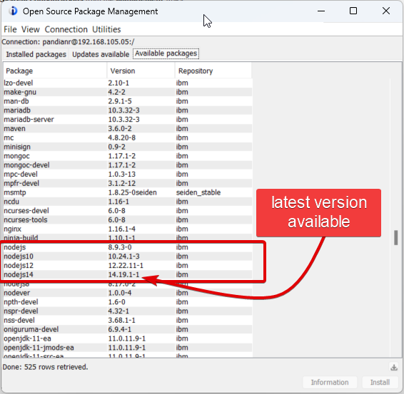
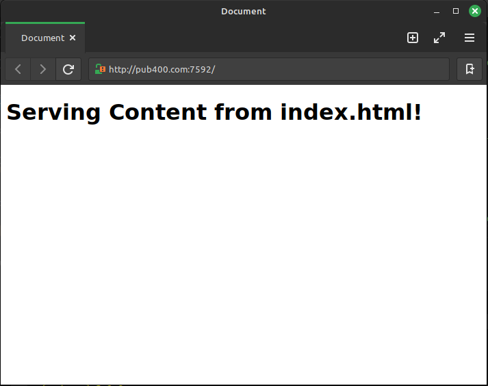

# Create a new app
**Step-1: Install Node**
Go to OSPM (Open Source Package Management) from the ACS application and click on the "Available Packages" to see which node versions are available to you. For me version 14 is the latest available version

```bash
yum install nodejs14 #notice the version 14
```
 

**Step-1.1: Initialize the node**
    Create a folder. Change Directory to the newly created folder and initialize a node project.

```bash
mkdir myapp1
cd myapp1
npm init -y
```

**Step-2: Install Dependencies**
Install below dependencies as well
```bash
npm i express ejs idb-pconnector  # required packages 
```

**Step-3: Create your first node app**
- `touch server.js` to create a new JS file called server
- Paste the below code in the new file

```js
const express = require("express"); // invoke the package to the constant express

const app = express(); // assign the package function to the constant app

port = 7592; // assign port# to the app

app.listen(port, function(){ // the listen method takes two params. 1) Port#, 2) the actual funcion it does when called
    console.log("successfully started a node.js instance!");
});

app.get('/', function(req, res){
    res.send("Hello world!");
});

```
___
**TIP: Install nodemon to auto restart the node server**
```bash
npm i -D nodemon # used to restart the node server whenever we make code change in server.js
```
Once installed, go to the packages.json and check the below entry is found at the bottom
```json
  "devDependencies": {
    "nodemon": "^3.1.0"
  }
```
If yes, then add an entry in the scripts section as below
```json
"scripts": {
    "dev": "nodemon server.js"
  }
```
The above key value pair means, whenever I run the script named dev, the `nodemon server.js` command would be executed. Thus ensuring restarting of node js server whenever a change is detected! The command to start the nodemon instance is below
```bash
npm run dev # dev - signifies the script name that we previously edited!
```


___

#### Point to an external HTML file instead serving content directly

So far we're only getting requests and we're sending responses as plain text (of course, with HTML), but it is best to point to an HTML document to serve. To do that follow the steps below.
1. Create an empty HTML file in the *myapp1* directory and design it to your liking.
2. Modify the server.js as below.
```js
app.get('/', function(req, res){
    // Instead of sending the response as plain text, we can send HTML files to be rendered as below.
    res.sendFile("/home/RAVI1/builds/js/myapp1/index.html");
});
```
3. Restart node.js by issuing the below command
`npm run dev`


**TIP: Use Relative path instead of Absolute Path for sendFile method**
It is best to use relative path to the current working directory to point files and serve content. To accomplish that we need to import a node module called *path*. 
```js
const = 
```

https://youtu.be/TYUK2TsxQjc?t=768